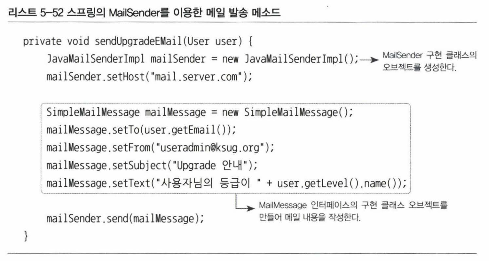

### upgradeLevel() 리팩토링


- ① : 현재 레벨이 무엇인지 파악하는 로직
- ② : 업그레이드 조건을 담은 로직
- ③ : 다음 단계의 레벨이 무엇이며 업그레이드를 위한 작업은 어떤 것인지
- ④ : 그 자체로는 의미가 없고, 멀리 떨어져있는 ⑤의 작업이 필요한지 알려주기 위한 임시 플래그 설정
- if 조건 블록들이 레벨 개수만큼 반복
- -> 따라서 리팩토링이 필요


1. 기본 흐름만 남겨두자

   현재 메소드는 자주 변경될 가능성이 있는 구체적인 내용이 추상적인 로직의 흐름과 함께 섞여있어

   기본 흐름만 먼저 만들어보자

   : 모든 사용자 정보를 가져와 한 명씩 업그레이드가 가능한지 확인하고, 가능하면 업그레이드를 한다.

```java
public void upgradeLevels() {
    List<User> users = userDao.getAll();
    for (User user : users) {
        if (canUpgradeLevel(level)) {
            upgradeLevel(user);
        }
    }
}
```

2. canUpgradeLevel() 메소드 구현

   상태에 따른 업그레이드 조건만 비교하면 끝. 

   주어진 User에 대해 업그레이드가 가능하면 true, 아니면 false를 리턴

   상태에 따라 업그레이드 조건만 비교하면 된다.

```java
private boolean canUpgradeLevel(User user) {
    level currentLevel = user.getLevel();
    switch (currentLevel) {
        case BASIC: return (user.getLogin >= 50);
        case SILVER: return (user.getRecommend() >= 30);
        case GOLD: return false;
        default: throw new IllegalArgumentException("Unknown Level" + currentLevel);
    }
}
```

3. upgradeLevel() 메소드 구현

   레벨의 순서와 다음 단계 레벨이 무엇인지 결정하는 일을 ```Level```에게 부여.

   ```java
   public enum Level {
       GOLD(3, null), SILVER(2, GOLD), BASIC(1, SILVER);
       
       private final int value;
       private final Level next;
       
       Level(int value, Level next) {
           this.value = value;
           this.next = next;
       }
       
       public int intValue() {
           return value;
       }
       
       public Level nextLevel() {
           return.this.next;
       }
       
       public static Level valueOf(int value) {
           switch(value) {
               case 1: return BASIC;
               case 2: return SILVER;
               case 3: return GOLD;
               default: throw new AssertionError("Unknown value" + value);
           }
       }
   }
   ```

   사용자 정보가 바뀌는 부분은 ```User```에게 부여

   ```java
   public void upgradeLevel() {
       Level nextLevel = this.level.nextLevel();
       if (nextLevel == null) {
           throw new IllegalStateException(this.level + "은 업그레이드가 불가능합니다");
       } else {
           this.level = nextLevel;
       }
   }
   ```

   간결해진 서비스의 ```upgradeLevel()```

   ```java
   private void upgradeLevel(User user) {
       user.upgradeLevel();
       userDao.update(user);
   }
   ```

   이제 ```BRONSE 레벨을 BASIC과 SLIVER사이에 추가하고 그 다음 레벨로 업그레이드 하는 조건은 로그인 횟수 80번이다. 그리고 가장 최근의 레벨 변경 날짜를 저장해두고, 레벨 변경시 콘솔에 로그를 남기도록 하라``` 는 수정요청이 들어왔을 때, 쉽게 변경할 수 있다.

5. 확장 : upgrade 함수를 service에서 분리시키기

   레벨 정책이 자주 바뀔 수 있다면 ```userService```에서 로직을 완전히 분리시켜 DI 받을 수 있도록 만든다.

```java
public interface UserLevelUpgradePolicy {
    boolean canUpgradeLevel(User user);
    void upgradeLevel(User user);
}
```


## 5.2 트랜잭션 서비스 추상화

> "정기 사용자 레벨 관리 작업을 수행하는 도중에 네트워크가 끊기거나 서버에 장애가 생겨서 작업을 완료할 수 없다면, 그때까지 진행된 변경된 사용자의 레벨은 그대로 둘까요? 아니면 모두 초기상태로 되돌려 놓아야 할까요?"

만약 중간에 문제가 발생해서 작업이 중단된다면 그때까지 진행된 변경 작업도 모두 취소시키도록 하고 싶을땐 어떻게 해야할까?


### 테스트를 만들자

중간에 실패하면 전부 되돌아가는지 확인할 수 있는 테스트를 만들자.

UserService를 상속받아 UserService를 대신하는 클래스를 만들어 사용하자.

- private으로 되어있는 upgradeLevel 함수를 protected로 변경

```java
static class TestUserService extends UserService {
    private String id;
    
    private TestUserService (String id) {
        this.id = id;
    }
    
    protected void upgradeLevel(User user) {
        if (user.getId().equals(this.id)) throw new TestUserServiceExeption();
        super.upgradeLevel(user);
    }
}
```

결과는 **실패**

**트랜잭션**  : 더 이상 나눌 수 없는 작은 단위. upgradeLevels()가 하나의 트랜잭션이 아니기 때문에 테스트가 실패함.

### 트랜잭션 경계 설정

* 트랜잭션 롤백 : 여러개의 sql을 사용할 때 중간에 문제가 생겼을 시, 앞의 sql 작업을 취소하는 작업

* 트랜잭션 커밋 : 여러개의 sql을 모두 수행한 후 DB에 알려주어 작업을 확정시키는 작업.

* 트랜잭션의 경계 : 애플리케이션에서 트랜잭션이 시작되고 끝나는 위치. 이 경계는 하나의 Connection이 만들어지고 닫히는 범위 안에 존재.

  (트랜잭션은 시작하는 지점과 끝나는 지점이 있다. 시작하는 방법은 한가지지만 끝내는 방법은 롤백, 커밋 두가지가 있다. )

* 트랜잭션 경계 설정 : setAutoCommit(false)로 트랜잭션의 시작을 선언하고, commit() 혹은 rollback()으로 트랜잭션을 종료하는 작업


데이터 액세스 코드를 DAO로 만들어 분리해놓았을 경우, DAO 메소드를 호출할 때마다 하나의 새로운 트랜잭션이 만들어지는 구조가 될 수밖에 없다. DAO 메소드에서 DB 커넥션을 매번 만들기 때문에 어쩔수 없이 나타는 결과이다. 그럼 어떻게 하나로 묶을 수있을까?

일단 커넥션 생성하는 부분을 Service로 뺄 수 있다. 하지만 그렇게되면 Connection을 계속 주고받아야하고, 책임을 나눴던 모든 기능들이 물거품이 된다. 다른 방법이 없을까?


### 트랜잭션 동기화

우선 ```UserService```의 ```upgradeLevels()``` 메소드가 트랜잭션 경계 설정을 해야 한다는 사실은 피할 수 없다.

때문에 Connection을 생성하고 트랜잭션의 시작과 종료를 관리해야한다. 하지만, 여기서 생성된 Connection은 **트랜잭션 동기화**를 통해 DAO에게 파라미터로 전달하지 않아도 된다.

* 트랜잭션 동기화 : UserService에서 트랜잭션을 시작하기 위해 만든 Connection 오브젝트를 특별한 장소에 저장해 보관하고, 이후 호출되는 DAO의 메소드에서는 저장된 Connection을 가져다 사용하는 것
* 정확히는 DAO가 사용하는 JdbcTemplate이 트랜잭션 동기화 방식을 이용
* 작업 스레드마다 독립적으로 Connection 오브젝터를 저장하고 관리하기 때문에 충돌이 발생하지 않는다.


### 트랜잭션 서비스 추상화

* 로컬 트랜잭션 : 하나의 DB 커넥션에 종속

* 글로벌 트랜잭션 : 별도의 트랜잭션 관리자를 통해 트랜잭션을 관리

* JTA : 글로벌 트랜잭션을 지원하는 트랜잭션 매니저를 지원하기 위한 API

  하나 이상의 DB가 참여하는 트랜잭션을 만들려면 JTA를 사용해야 함.

  

  문제는 트랜잭션 API에 UserService가 의존하고 있다는 것이다.

  

  UserService에서 경계설정을 해줘야하는건 변함이 없다. 하지만, 트랜잭션의 경계설정은 모두 일정한 패턴의 일관된 구조를 가지고있다. 그렇다면 추상화를 통해 의존적이지 않은 코드를 만들 수 있지 않을까?

* PlatformTransactionalManager : 스프링이 제공하는, 트랜잭션 기술의 공통점을 담은 트랜잭션 추상화 기술


특히 PlatformTransactionalManager는 싱글톤으로 사용할 수 있기 때문에 빈으로 등록해서 사용할 수 있다.


## 5.3 서비스 추상화와 단일 책임 원칙

애플리케이션 로직의 종류에 따른 수평적인 구분이든, 로직과 기술이라는 수직적인 구분이든 모두 결합도가 낮으며, 서로 영향을 주지 않고 자유롭게 확장될 수 있는 구조를 만들 수 있는데 스프링 DI가 중요한 역할을 하고 있다.

#### 단일 책임 원칙

- 하나의 모듈은 한 가지 책임을 가져야 한다.
- 하나의 모듈이 바뀌는 이유는 한 가지여야 한다.

(어쨌든 스프링 DI가 객체지향 설계에 좋다는 이야기)


## 5.4 메일 서비스 추상화

> "레벨이 업그레이드 되는 사용자에게 안내 메일을 발송해주세요."

해야할 일

- 사용자의 이메일 정보 관리 (User에 email 필드 추가)
- 업그레이드 작업을 담은 UserSerivce의 upgradeLevel() 메소드에 메일 발송 기능을 추가

JavaMail

- 자바에서 메일을 발송할 때 사용할 수 있는 표준 기술.

```java
protected void upgradeLevel(User user) {
    user.upgradeLevel();
    userDao.update(user);
    sendUpgradeEMail(user);
}
```


메일은 부담이 큰 서비스라 매번 테스트하기 어렵다. 그리고 이미 SMTP로 만들어진 메일 서버는 충분히 메일을 잘 보낼 수 있다고 판단할 수 있다. 따라서 테스트용 JavaMail을 이용해서 테스트할 수 있지 않을까?


but,  JavaMail은 테스트하기 힘든 악명높은 API중 하나. 하지만 걱정 마시라. 스프링이 JavaMail에 대한 추상화 기능을 제공한다!




